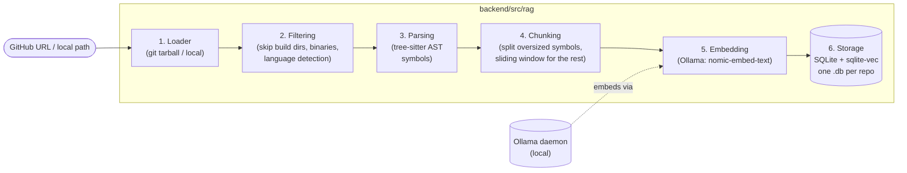
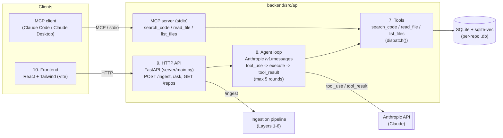
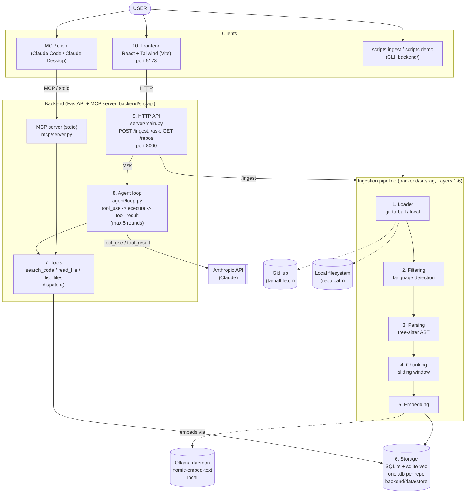

# Application Architecture

Repo-Copilot has two flows sharing one storage layer:
**ingestion** (build the index for a repo)
**serving** (answer questions against an ingested repo, via HTTP API, MCP server, or the frontend).

See the README for the full layer-by-layer design rationale.

## Ingestion pipeline (Layers 1–6)

## Serving path (Layers 7–10)

## End-to-End Architecture

## Notes

- The two flows share the same storage layer.
- `Tools` (Layer 7) is a single implementation reused by both the MCP server and the agent loop.
- Requires a locally running Ollama daemon (`nomic-embed-text`) for embedding, and an `ANTHROPIC_API_KEY` for the reasoning layer and agent loop's calls to Claude.
